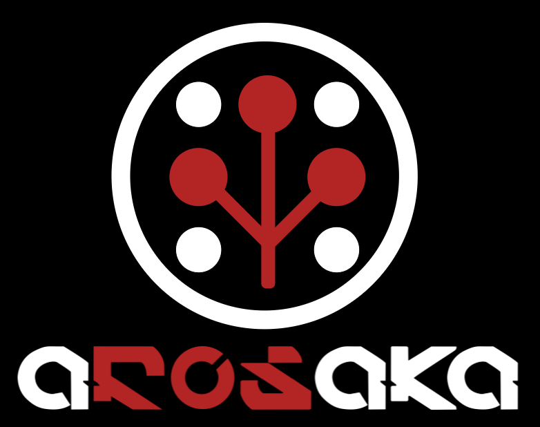

#  AROSAKA Team NTI FR repository

Рокербои из политеха пришли покекать на НТИ . Покекали, OpenCV изучили, коптеры пороняли.
Если хотите тоже, запускайте файл tracking_landing.py. Остальное - модули, выполняющие те или иные функции.

# Релизованный функционал:

* Взлет\посадка;
* Поиск и запись цветных квадратиков (продуктов) на складе;
* (почти) Реализован поиск места доставки (дронпоинта);
* (реализован и не протестирован) Алгоритм посадки на дронпоинт по информации с камеры;
* Получение удовольствия от созерцания полета дрона;
* Получение переживаний за правильность полета дрона;

# План полёта:

* Взлет
* Полет в зону склада
* Сканирование склада
* Поиск дронпоинтов на поле
* Посадка на дронпоинт с цветовой индикацией о доставке
* Полет в зону окончательной посадки
* Посадка и завершение полета (ни разу не было достигнуто)

